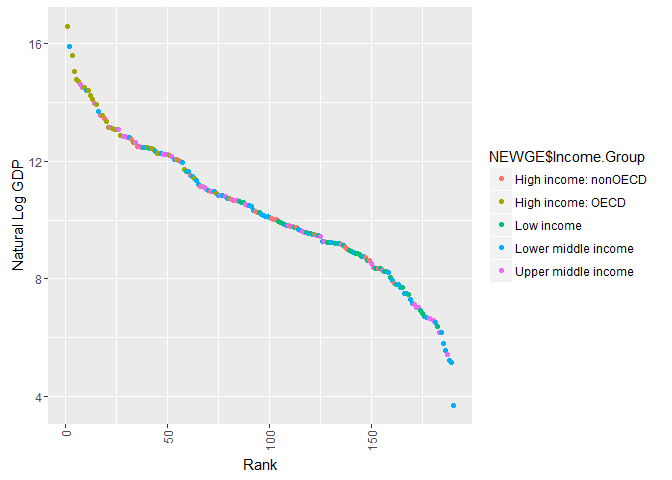

# GDP and Education
Sharon Teo  
June 19, 2016  


# Libraries required

```r
library(repmis)
library(RCurl)
library(bitops)
library(ggplot2)
library(downloader)
library(dplyr)
```

# Introduction
The purpose of this project is to visualize GDP across countries and income groups using the dataset  provided by client. The data set comes from worldbank.org. The first data set consists of gross domestic product ranking by countries for economies around the world while the second data set consists of education statistics and income levels. R is used to clean, merge the two files together, analyze and summarize the findings from the given data set.

# Download files from World Bank website

```r
site="https://d396qusza40orc.cloudfront.net/getdata%2Fdata%2FGDP.csv" 
download.file(site,destfile="./getdata%2Fdata%2FGDP.csv")
site="https://d396qusza40orc.cloudfront.net/getdata%2Fdata%2FEDSTATS_Country.csv" 
download.file(site,destfile="./getdata%2Fdata%2FEDSTATS_Country.csv")
```

# Read the files into R

```r
GDP <- read.csv("getdata%2Fdata%2FGDP.csv",header=TRUE)
EDU <- read.csv("getdata%2Fdata%2FEDSTATS_Country.csv", header=FALSE)
```

# Data cleansing

```r
GDP <- read.csv("getdata%2Fdata%2FGDP.csv", stringsAsFactors=FALSE, header=TRUE)
GDPraw <- GDP
# Remove redundant columns from GDPraw data set
GDPraw[6:10] <-list(NULL)
GDPraw$X.1 <- NULL
GDPdata <- GDPraw[5:330,]
# Assign new headings to GDPdata
names(GDPdata) <- c("Country.Code", "Ranking", "Short.Name", "GDP")
GDPdata$Ranking <- as.numeric(GDPdata$Ranking)
# Remove commas from GDP
GDPdata$GDP <- gsub(",","",GDPdata$GDP)
# Convert GDP to numeric
GDPdata$GDP <- as.numeric(GDPdata$GDP)
head(GDPdata)
```

```
##    Country.Code Ranking     Short.Name      GDP
## 5           USA       1  United States 16244600
## 6           CHN       2          China  8227103
## 7           JPN       3          Japan  5959718
## 8           DEU       4        Germany  3428131
## 9           FRA       5         France  2612878
## 10          GBR       6 United Kingdom  2471784
```

```r
EDUraw <- EDU
# Remove redundant columns from EDUraw data set
EDUraw[4:30] <-list(NULL)
EDUraw[2] <- NULL
EDUdata <- EDUraw[2:240,]
# Assign new headings to EDUdata
names(EDUdata) <- c("Country.Code", "Income.Group", "Short.Name")
head(EDUdata)
```

```
##   Country.Code         Income.Group           Short.Name
## 2          ABW High income: nonOECD                Aruba
## 3          ADO High income: nonOECD              Andorra
## 4          AFG           Low income          Afghanistan
## 5          AGO  Lower middle income               Angola
## 6          ALB  Upper middle income              Albania
## 7          ARE High income: nonOECD United Arab Emirates
```

```r
# Merge GDP and EDU
GDPEDU <- merge(GDPdata,EDUdata,by="Country.Code")
head(GDPEDU)
```

```
##   Country.Code Ranking         Short.Name.x    GDP         Income.Group
## 1          ABW     161                Aruba   2584 High income: nonOECD
## 2          ADO      NA              Andorra     NA High income: nonOECD
## 3          AFG     105          Afghanistan  20497           Low income
## 4          AGO      60               Angola 114147  Lower middle income
## 5          ALB     125              Albania  12648  Upper middle income
## 6          ARE      32 United Arab Emirates 348595 High income: nonOECD
##           Short.Name.y
## 1                Aruba
## 2              Andorra
## 3          Afghanistan
## 4               Angola
## 5              Albania
## 6 United Arab Emirates
```

# Match the data based on the country shortcode. How many of the IDs match?  
##224 - 35 NA = 189 IDs match

```r
summary(GDPEDU)
```

```
##  Country.Code          Ranking       Short.Name.x            GDP          
##  Length:224         Min.   :  1.00   Length:224         Min.   :      40  
##  Class :character   1st Qu.: 48.00   Class :character   1st Qu.:    7700  
##  Mode  :character   Median : 95.00   Mode  :character   Median :   37489  
##                     Mean   : 95.31                      Mean   : 1460821  
##                     3rd Qu.:143.00                      3rd Qu.:  263046  
##                     Max.   :190.00                      Max.   :72440449  
##                     NA's   :35                          NA's   :21        
##                Income.Group         Short.Name.y
##                      :14    Afghanistan   :  1  
##  High income: nonOECD:37    Albania       :  1  
##  High income: OECD   :30    Algeria       :  1  
##  Income Group        : 0    American Samoa:  1  
##  Low income          :40    Andorra       :  1  
##  Lower middle income :56    Angola        :  1  
##  Upper middle income :47    (Other)       :218
```

# Sort the data frame in ascending order by GDP rank (so United States is last). What is the 13th country in the resulting data frame?  
##St. Kitts and Nevis is the 13th country

```r
#sort by GDP (ascending)
NEWGE <- GDPEDU[order(GDPEDU$GDP),] 
#We See There is 14 blank Income Groups
NEWGE=subset(NEWGE, NEWGE$Income.Group!="")
NEWGE=subset(NEWGE, NEWGE$Income.Group!="Income Group")
NEWGE[1:13,1:5]
```

```
##     Country.Code Ranking                   Short.Name.x GDP
## 204          TUV     190                         Tuvalu  40
## 105          KIR     189                       Kiribati 175
## 132          MHL     188               Marshall Islands 182
## 161          PLW     187                          Palau 228
## 185          STP     186          São Tomé and Principe 263
## 68           FSM     185          Micronesia, Fed. Sts. 326
## 200          TON     184                          Tonga 472
## 51           DMA     183                       Dominica 480
## 42           COM     182                        Comoros 596
## 219          WSM     181                          Samoa 684
## 212          VCT     180 St. Vincent and the Grenadines 713
## 78           GRD     178                        Grenada 767
## 106          KNA     178            St. Kitts and Nevis 767
##            Income.Group
## 204 Lower middle income
## 105 Lower middle income
## 132 Lower middle income
## 161 Upper middle income
## 185 Lower middle income
## 68  Lower middle income
## 200 Lower middle income
## 51  Upper middle income
## 42           Low income
## 219 Lower middle income
## 212 Upper middle income
## 78  Upper middle income
## 106 Upper middle income
```
# What are the average GDP rankings for the "High income: OECD" and "High income: nonOECD" groups? 
##High Income OECD=$1483917 High Income: nonOECD=$104350

```r
#Taking a subset of data that consist only of income in High OECD and nonOECD
HOECD=subset(NEWGE,NEWGE$Income.Group=='High income: OECD')
HNOECD=subset(NEWGE,NEWGE$Income.Group=='High income: nonOECD')
summary(HOECD)
```

```
##  Country.Code          Ranking       Short.Name.x            GDP          
##  Length:30          Min.   :  1.00   Length:30          Min.   :   13579  
##  Class :character   1st Qu.: 12.25   Class :character   1st Qu.:  211147  
##  Mode  :character   Median : 24.50   Mode  :character   Median :  486528  
##                     Mean   : 32.97                      Mean   : 1483917  
##                     3rd Qu.: 45.75                      3rd Qu.: 1480047  
##                     Max.   :122.00                      Max.   :16244600  
##                                                                           
##                Income.Group         Short.Name.y
##                      : 0    Australia     : 1   
##  High income: nonOECD: 0    Austria       : 1   
##  High income: OECD   :30    Belgium       : 1   
##  Income Group        : 0    Canada        : 1   
##  Low income          : 0    Czech Republic: 1   
##  Lower middle income : 0    Denmark       : 1   
##  Upper middle income : 0    (Other)       :24
```

```r
summary(HNOECD)
```

```
##  Country.Code          Ranking       Short.Name.x            GDP        
##  Length:37          Min.   : 19.00   Length:37          Min.   :  2584  
##  Class :character   1st Qu.: 58.50   Class :character   1st Qu.: 12838  
##  Mode  :character   Median : 94.00   Mode  :character   Median : 28373  
##                     Mean   : 91.91                      Mean   :104350  
##                     3rd Qu.:125.00                      3rd Qu.:131205  
##                     Max.   :161.00                      Max.   :711050  
##                     NA's   :14                          NA's   :14      
##                Income.Group   Short.Name.y
##                      : 0    Andorra : 1   
##  High income: nonOECD:37    Aruba   : 1   
##  High income: OECD   : 0    Bahrain : 1   
##  Income Group        : 0    Barbados: 1   
##  Low income          : 0    Bermuda : 1   
##  Lower middle income : 0    Brunei  : 1   
##  Upper middle income : 0    (Other) :31
```
# Plot the GDP for all of the countries. Use ggplot2 to color your plot by Income Group.


```r
plot(NEWGE$Ranking,log(NEWGE$GDP),xlab="Rank",ylab="GDP",main="GDP Across Country Rankings")
```

<!-- -->

```r
INC.TAB=table(NEWGE$Income.Group)
INC.TAB
```

```
## 
##                      High income: nonOECD    High income: OECD 
##                    0                   37                   30 
##         Income Group           Low income  Lower middle income 
##                    0                   40                   56 
##  Upper middle income 
##                   47
```

```r
barplot(INC.TAB,xlab="",ylab="Counts",main="GDP Across Country Rankings",col=rainbow(7),las=3,cex.names = .45)
```

<!-- -->

```r
# Shows the breakdown across country ranking, color coded by income group
qplot(as.numeric(NEWGE$Ranking), data=NEWGE, geom="bar", weight=log(NEWGE$GDP), ylab="GDP",xlab="Ranking",main = "GDP According to Country Rank",fill=NEWGE$Income.Group)+
theme(axis.text.x=element_text(angle=90,hjust=1,vjust=0.5))
```

<!-- -->

```r
g = ggplot(NEWGE, aes(x = as.numeric(NEWGE$Ranking), y=log(NEWGE$GDP)))  + geom_point()+
aes(colour = NEWGE$Income.Group)+
labs(x="Rank",y="Natural Log GDP")+ 
theme(axis.text.x=element_text(angle=90,hjust=1,vjust=0.5))

g
```

<!-- -->

#Cut the GDP ranking into 5 separate quantile groups. Make a table versus Income.Group. How many countries are Lower middle income but among the 38 nations with highest GDP?
##3


```r
#Breaks the data set in slices according to GDP. Divide countries into five groups by GDP. 1(low income) reflects the lowest tier of GDP and 5 is highest(wealthy nations)
NEWGE$quantile <- ntile(NEWGE$GDP, 5)
table(NEWGE$quantile,NEWGE$Income.Group)
```

```
##    
##        High income: nonOECD High income: OECD Income Group Low income
##   1  0                    3                 0            0         12
##   2  0                    5                 1            0         18
##   3  0                    8                 2            0          6
##   4  0                    6                14            0          1
##   5  0                    1                13            0          0
##    
##     Lower middle income Upper middle income
##   1                  16                  11
##   2                  10                   8
##   3                  15                  11
##   4                  10                  11
##   5                   3                   4
```

# Conclusion
## In conclusion we see that GDP and income groups do not sync up properly.     There is incongruity between the two variables. We would expect that there    would be more high income groups in the highly ranked countries, but it was    not the case in all situations. After visualizing the data it was clear that  there are countries that fall into low income groups yet are in the top 20    percent of GDP. Additional data recording is needed for a more through        representation of countries wealth/prosperity in a global context.

