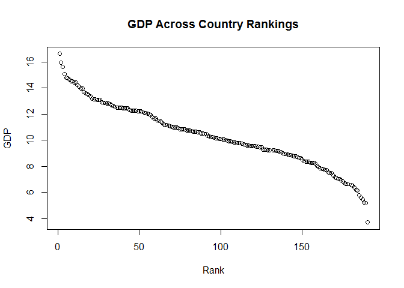

# GDP and Income Levels
Sharon Teo  
June 19, 2016  


# Libraries required

```r
library(repmis)
library(RCurl)
library(bitops)
library(ggplot2)
library(downloader)
library(dplyr)
```

# Introduction
The purpose of this project is to visualize GDP across countries and income levels using the dataset  provided by client. The data set comes from worldbank.org. The first data set consists of gross domestic product ranking by countries for economies around the world while the second data set consists of education statistics and income levels. R is used to clean, merge the two files together, analyze and summarize the findings from the given data set.

# Download files from World Bank website

```r
site="https://d396qusza40orc.cloudfront.net/getdata%2Fdata%2FGDP.csv" 
download.file(site,destfile="./getdata%2Fdata%2FGDP.csv")
site="https://d396qusza40orc.cloudfront.net/getdata%2Fdata%2FEDSTATS_Country.csv" 
download.file(site,destfile="./getdata%2Fdata%2FEDSTATS_Country.csv")
```

# Read the files into R

```r
GDP <- read.csv("getdata%2Fdata%2FGDP.csv",header=TRUE)
EDU <- read.csv("getdata%2Fdata%2FEDSTATS_Country.csv", header=FALSE)
```

# Data cleansing

```r
GDP <- read.csv("getdata%2Fdata%2FGDP.csv", stringsAsFactors=FALSE, header=TRUE)
GDPraw <- GDP
# Remove redundant columns from GDPraw data set
GDPraw[6:10] <-list(NULL)
GDPraw$X.1 <- NULL
GDPdata <- GDPraw[5:330,]
# Assign new headings to GDPdata
names(GDPdata) <- c("Country.Code", "Ranking", "Short.Name", "GDP")
GDPdata$Ranking <- as.numeric(GDPdata$Ranking)
# Remove commas from GDP
GDPdata$GDP <- gsub(",","",GDPdata$GDP)
# Convert GDP to numeric
GDPdata$GDP <- as.numeric(GDPdata$GDP)
GDPdata=na.exclude(GDPdata)
nrow(GDPdata)
```

```
## [1] 190
```

```r
EDUraw <- EDU
# Remove redundant columns from EDUraw data set
EDUraw[4:30] <-list(NULL)
EDUraw[2] <- NULL
EDUdata <- EDUraw[2:240,]
# Assign new headings to EDUdata
names(EDUdata) <- c("Country.Code", "Income.Group", "Short.Name")
# Merge GDP and EDU
GDPEDU <- merge(EDUdata,GDPdata,by="Country.Code")
GDPEDU=subset(GDPEDU, is.na(GDPEDU$Country.Code)== FALSE)
summary(GDPEDU)
```

```
##   Country.Code               Income.Group              Short.Name.x
##  ABW    :  1                       : 0    Afghanistan        :  1  
##  AFG    :  1   High income: nonOECD:23    Albania            :  1  
##  AGO    :  1   High income: OECD   :30    Algeria            :  1  
##  ALB    :  1   Income Group        : 0    Angola             :  1  
##  ARE    :  1   Low income          :37    Antigua and Barbuda:  1  
##  ARG    :  1   Lower middle income :54    Argentina          :  1  
##  (Other):183   Upper middle income :45    (Other)            :183  
##     Ranking       Short.Name.y            GDP          
##  Min.   :  1.00   Length:189         Min.   :      40  
##  1st Qu.: 48.00   Class :character   1st Qu.:    6972  
##  Median : 95.00   Mode  :character   Median :   28242  
##  Mean   : 95.31                      Mean   :  379597  
##  3rd Qu.:143.00                      3rd Qu.:  205789  
##  Max.   :190.00                      Max.   :16244600  
## 
```

# Match the data based on the country shortcode. How many of the IDs match?  
##224 - 35 NA's = 189 IDs match

```r
summary(GDPEDU)
```

```
##   Country.Code               Income.Group              Short.Name.x
##  ABW    :  1                       : 0    Afghanistan        :  1  
##  AFG    :  1   High income: nonOECD:23    Albania            :  1  
##  AGO    :  1   High income: OECD   :30    Algeria            :  1  
##  ALB    :  1   Income Group        : 0    Angola             :  1  
##  ARE    :  1   Low income          :37    Antigua and Barbuda:  1  
##  ARG    :  1   Lower middle income :54    Argentina          :  1  
##  (Other):183   Upper middle income :45    (Other)            :183  
##     Ranking       Short.Name.y            GDP          
##  Min.   :  1.00   Length:189         Min.   :      40  
##  1st Qu.: 48.00   Class :character   1st Qu.:    6972  
##  Median : 95.00   Mode  :character   Median :   28242  
##  Mean   : 95.31                      Mean   :  379597  
##  3rd Qu.:143.00                      3rd Qu.:  205789  
##  Max.   :190.00                      Max.   :16244600  
## 
```

# Sort the data frame in ascending order by GDP rank (so United States is last). What is the 13th country in the resulting data frame?  
##St. Kitts and Nevis is the 13th country

```r
#sort by GDP (ascending)
NEWGE <- GDPEDU[order(GDPEDU$Ranking),] 
```
# What are the average GDP rankings for the "High income: OECD" and "High income: nonOECD" groups? 
##High Income OECD=32.97 High Income: nonOECD=91.91

```r
#Taking a subset of data that consist only of income in High OECD and nonOECD
HOECD=subset(NEWGE,NEWGE$Income.Group=='High income: OECD')
HNOECD=subset(NEWGE,NEWGE$Income.Group=='High income: nonOECD')
summary(HOECD)
```

```
##   Country.Code               Income.Group         Short.Name.x
##  AUS    : 1                        : 0    Australia     : 1   
##  AUT    : 1    High income: nonOECD: 0    Austria       : 1   
##  BEL    : 1    High income: OECD   :30    Belgium       : 1   
##  CAN    : 1    Income Group        : 0    Canada        : 1   
##  CHE    : 1    Low income          : 0    Czech Republic: 1   
##  CZE    : 1    Lower middle income : 0    Denmark       : 1   
##  (Other):24    Upper middle income : 0    (Other)       :24   
##     Ranking       Short.Name.y            GDP          
##  Min.   :  1.00   Length:30          Min.   :   13579  
##  1st Qu.: 12.25   Class :character   1st Qu.:  211147  
##  Median : 24.50   Mode  :character   Median :  486528  
##  Mean   : 32.97                      Mean   : 1483917  
##  3rd Qu.: 45.75                      3rd Qu.: 1480047  
##  Max.   :122.00                      Max.   :16244600  
## 
```

```r
summary(HNOECD)
```

```
##   Country.Code               Income.Group   Short.Name.x    Ranking      
##  ABW    : 1                        : 0    Aruba   : 1    Min.   : 19.00  
##  ARE    : 1    High income: nonOECD:23    Bahrain : 1    1st Qu.: 58.50  
##  BHR    : 1    High income: OECD   : 0    Barbados: 1    Median : 94.00  
##  BHS    : 1    Income Group        : 0    Bermuda : 1    Mean   : 91.91  
##  BMU    : 1    Low income          : 0    Brunei  : 1    3rd Qu.:125.00  
##  BRB    : 1    Lower middle income : 0    Croatia : 1    Max.   :161.00  
##  (Other):17    Upper middle income : 0    (Other) :17                    
##  Short.Name.y            GDP        
##  Length:23          Min.   :  2584  
##  Class :character   1st Qu.: 12838  
##  Mode  :character   Median : 28373  
##                     Mean   :104350  
##                     3rd Qu.:131205  
##                     Max.   :711050  
## 
```
# Plot the GDP for all of the countries. Use ggplot2 to color your plot by Income Group.


```r
plot(NEWGE$Ranking,log(NEWGE$GDP),xlab="Rank",ylab="GDP",main="GDP Across Country Rankings")
```

<!-- -->

```r
INC.TAB=table(NEWGE$Income.Group)
INC.TAB
```

```
## 
##                      High income: nonOECD    High income: OECD 
##                    0                   23                   30 
##         Income Group           Low income  Lower middle income 
##                    0                   37                   54 
##  Upper middle income 
##                   45
```

```r
barplot(INC.TAB,xlab="",ylab="Counts",main="GDP Across Country Rankings",col=rainbow(7),las=3,cex.names = .45)
```

<!-- -->

```r
# Shows the breakdown across country ranking, color coded by income group
qplot(as.numeric(NEWGE$Ranking), data=NEWGE, geom="bar", weight=log(NEWGE$GDP), ylab="GDP",xlab="Ranking",main = "GDP According to Country Rank",fill=NEWGE$Income.Group)+
theme(axis.text.x=element_text(angle=90,hjust=1,vjust=0.5))
```

<!-- -->

```r
g = ggplot(NEWGE, aes(x = as.numeric(NEWGE$Ranking), y=log(NEWGE$GDP)))  + geom_point()+
aes(colour = NEWGE$Income.Group)+
labs(x="Rank",y="Natural Log GDP")+ 
theme(axis.text.x=element_text(angle=90,hjust=1,vjust=0.5))

g
```

<!-- -->

#Cut the GDP ranking into 5 separate quantile groups. Make a table versus Income.Group. How many countries are Lower middle income but among the 38 nations with highest GDP?
##4


```r
#Breaks the data set in slices according to GDP. Divide countries into five groups by GDP. 1(low income) reflects the lowest tier of GDP and 5 is highest(wealthy nations)
NEWGE$quantile <- ntile(NEWGE$GDP, 5)
table(NEWGE$quantile,NEWGE$Income.Group)
```

```
##    
##        High income: nonOECD High income: OECD Income Group Low income
##   1  0                    2                 0            0         11
##   2  0                    4                 1            0         16
##   3  0                    8                 1            0          9
##   4  0                    5                10            0          1
##   5  0                    4                18            0          0
##    
##     Lower middle income Upper middle income
##   1                  16                   9
##   2                   9                   8
##   3                  11                   9
##   4                  14                   8
##   5                   4                  11
```

# Conclusion
## In conclusion we see that GDP and income groups do not sync up properly.     There is incongruity between the two variables. We would expect that there    would be more high income groups in the highly ranked countries, but it was    not the case in all situations. After visualizing the data it was clear that  there are countries that fall into low income groups yet are in the top 20    percent of GDP. Additional data recording is needed for a more through        representation of countries wealth/prosperity in a global context.

